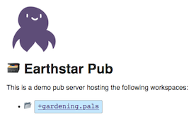
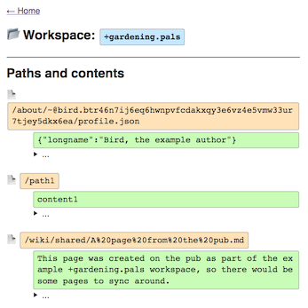

# Earthstar Pub

Hosts and syncs [Earthstar](https://github.com/cinnamon-bun/earthstar) workspaces over HTTP.  One pub server can hold multiple Earthstar workspaces.

Data is stored in an SQLite file.  You can also just keep data in memory if you don't have a persistent filesystem on your server, but it will be lost when the server restarts... and then sync'd again from the clients. :)

You can
* View the data through a web interface
* Sync your local data to/from the server using [earthstar-cli](https://github.com/cinnamon-bun/earthstar-cli/)
* Sync to Earthstar web apps such as Twodays-Crossing, Earthstar-Foyer, Earthstar-Lobby, etc.

Pub servers don't sync directly to each other (yet?) and clients don't sync directly to each other (yet).  Only Pub<-->Client connections are made.  But each client can talk to several pubs, and it decides which pubs it wants to push its workspaces to.


## Demo

https://earthstar-demo-pub-v5-a.glitch.me/





## Running on Glitch

Make your own copy on Glitch by going [here](https://glitch.com/~earthstar-demo-pub-v5-a) and clicking "Remix this".

Or start a new Glitch project from scratch:

* Make a new Express project
* Go to Glitch's `package.json`, click "Add package", and add `earthstar-pub`
* Delete the demo code from `server.js`
* Copy-paste the code from this repo's [`example.js`](https://github.com/earthstar-project/earthstar-pub/blob/master/example.js) into Glitch's `server.js`
* Rename your project, at the top left
* Click "🕶 Show > In a New Window" to visit your pub

On Glitch, the sqlite data is stored in a special hidden directory (maybe called `/.data`, I don't remember) which nobody can see or clone from your project.  Files in that directory persist even when Glitch restarts your app.

If the pub is running just in memory-storage mode, it will forget all the data when Glitch restarts it (which happens often).

## Easy command-line install

Install
```
npm install --global earthstar-pub
```

Run
```
earthstar-pub
```

Then visit http://localhost:3333.

Options:
```
Usage: earthstar-pub [options]

Run an HTTP server which hosts and replicates Earthstar workspaces.

Options:
  -p, --port <port>   Which port to serve on
                        (default: "3333")

  --readonly          Don't accept any pushed data from users
                        (default: false)

  -c, --closed        Accept data to existing workspaces but
                        don't create new workspaces.
                        (default: false)

  -d, --discoverable  Allow workspace addresses to be discovered
                        via the web interface.  Only use
                        this for testing purposes.
                        (default: false)

  -s, --sqlite        Use sqlite instead of memory.  Default is memory.
                        (default: false)

  --dataFolder <folder>
                      Folder in which to store sqlite files.
                        Defaults to current directory.
                        Only used for sqlite, not memory.
                        (default: ".")
                      
  --logLevel <logLevel>
                      Show this many logs. 0 = none, 1 = basic, 2 = verbose,
                        3 = include sensitive information (workspace addresses).
                        (default: "0")
```

## Developing

Clone and install
```
git clone https://github.com/earthstar-project/earthstar-pub
cd earthstar-pub
npm install
```

Compile typescript
```
npm run build
```

Start the server
```
npm start
```

Then visit http://localhost:3333.
